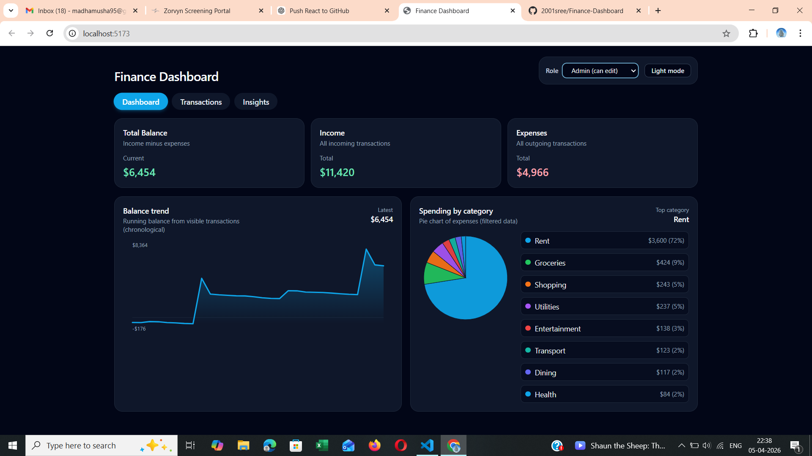
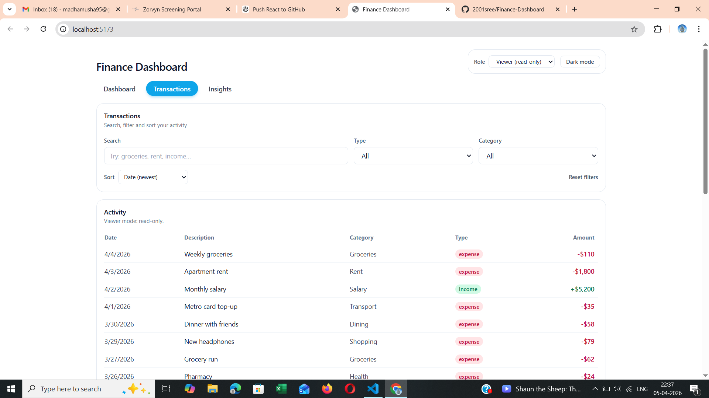
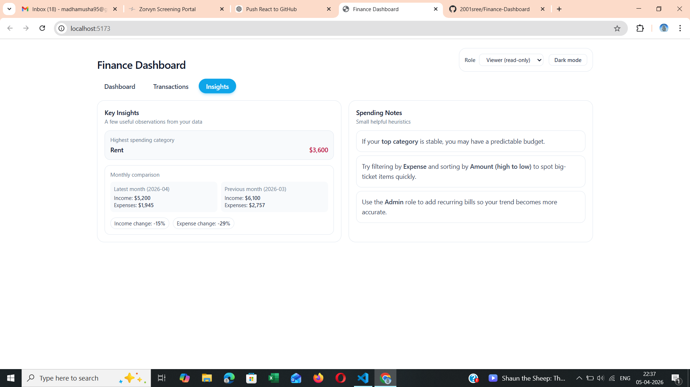

Finance Dashboard

A modern **Finance Dashboard** built using React. It helps users track income, expenses, and financial insights with a clean UI.


##  Features

-  Dashboard summary (income, expense, balance)
-  Filter transactions (date/category/type)
-  Add & delete transactions
-  Charts for financial insights
-  Data stored using Local Storage
-  Responsive UI with Tailwind CSS

---

##  Tech Stack

- React.js
- Vite
- Tailwind CSS
- JavaScript (ES6)
- Local Storage

---

##  Screenshots

### Dashboard View
 
 HEAD
### Transaction View


### Insight View


### Add Transaction

 5262fab (Update README.md)


### Transaction view


### Insights view


 ca06b57b88a6a0dfab88649854e35fad7b24ff13
---

##  Installation

```bash
git clone https://github.com/2001sree/Finance-Dashboard.git
cd Finance-Dashboard
npm install
npm run dev
